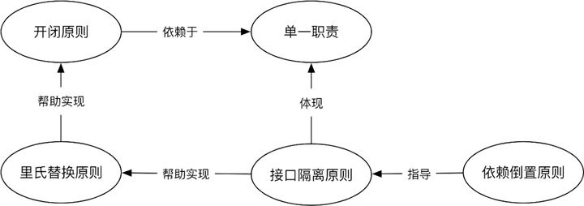

## 什么是SOLID原则

SOLID 原则其实是用来指导软件设计的，它一共分为五条设计原则，分别是：

*   单一职责原则（SRP）
*   开闭原则（OCP）
*   里氏替换原则（LSP）
*   接口隔离原则（ISP）
*   依赖倒置原则（DIP）

## 单一职责原则（SRP）

单一职责原则（Single Responsibility Principle），它的定义是：应该有且仅有一个原因引起类的变更。**简单地说：接口职责应该单一，不要承担过多的职责。**

例如，假设我们正在用 Java 设计一个银行应用程序，其中有一个`SavingsAccount`类，该类允许借记、贷记和`sendNotification`等基本操作。 `sendNotification`方法采用名为`NotificationMedium`的枚举（如电子邮件、SMS 等）并使用适当的介质发送更新。我们将为此编写代码，如下所示。

```java
public class SavingsAccount {
    public int balance;
    public String name;
    public SavingsAccount(int initialBalance, String name) {
        this.balance = initialBalance;
        this.name = name;
        System.out.println("Created a savings account with balance = " + initialBalance);
    }
    public void debit(int amountToDebit) { 
        // debit business logic 
    }
    public void credit(int amountToCredit) { 
        // credit business logic 
    }
    public void sendNotification(NotificationMedium medium) {
        if (medium == NotificationMedium.SMS) { 
            // Send SMS here 
        } else if (medium == NotificationMedium.EMAIL) { 
            // Send Email here 
        }
    }
}
```

```java
public enum NotificationMedium {
    SMS,
    EMAIL
}
```

现在，如果您查看上面的`SavingsAccount`类，您会发现它可能由于多种原因而发生更改：

1.  `SavingsAccount`类的核心逻辑是否有任何变化（如`debit` 、 `credit`等）。
2.  如果银行决定引入新的通知媒介（比如 WhatsApp）。

这违反了 单一职责原则。为了解决这个问题，我们将创建一个单独的类来发送通知。

我们按照SOLID原则重构上面的代码

```java
public class SavingsAccount {
    public int balance;
    public String name;
    public SavingsAccount(int initialBalance, String name) {
        this.balance = initialBalance;
        this.name = name;
        System.out.println("Created a savings account with balance = " + initialBalance);
    }
    public void debit(int amountToDebit) { 
        // debit business logic 
    }
    public void credit(int amountToCredit) { 
        // credit business logic 
    }
    public void sendNotification(Medium medium) {
        Sender.sendNotification(medium, this);
    }
}
```

```java
public enum NotificationMedium {
    SMS,
    EMAIL
}
```

```java
public class Sender {
    public static void sendNotification(NotificationMedium medium, SavingsAccount account) {
        // extract account data from the account object 
        if (medium == NotificationMedium.SMS) { 
          //logic to send SMS here 
        } else if (medium == NotificationMedium.EMAIL) { 
          // logic to send Email here 
        }
    }
}
```

现在，由于我们已经重构了代码，如果`NotificationMedium`或格式有任何变化，我们将更改`Sender`类。但是，如果`SavingsAccount`的核心逻辑发生变化， `SavingsAccount`类也会发生变化。

## 开闭原则（OCP）

开闭原则（Open Closed Principle），它的定义是：一个软件实体，如类、模块和函数应该对扩展开放，对修改关闭。**简单地说：就是当别人要修改软件功能的时候，使得他不能修改我们原有代码，只能新增代码实现软件功能修改的目的。**

要查看开闭原则的示例，让我们看一下购物车的示例（例如在电子商务网站上实现的购物车）。

我将创建一个名为`Cart`的类，其中包含您可以添加到其中的`Item`列表。根据商品的类型及其税收，我们希望创建一个方法来计算`Cart`类中的购物车总价值。

```java
public class Cart {
    private List < Item > items;
    public Cart() {
        this.items = new ArrayList < > ();
    }
    public void addToCart(Item item) {
        items.add(item);
    }
    public double calculateCartValue() {
        double value = 0.0;
        for (Item item: items) {
            if (item.getItemType() == GIFT) { // 8% tax on gift + 2% gift wrap cost 
                value += (item.getValue() * 1.08) + item.getValue() * 0.02
            } else if (item.getItemType() == ItemType.ELECTRONIC_ITEM) {
                value += (item.getValue() * 1.11);
            } else {
                value += item.getValue() * 1.10;
            }
        }
        return value;
    }
}
```

```java
@Getter 
@Setter 
public abstract class Item {
    protected double price;
    private ItemType itemType;
    public double getValue() {
        return price;
    }
}
```

```java
public enum ItemType {
    ELECTRONIC,
    GIFT
}
```

在上面的示例中， `calculateCartValue`方法通过迭代购物车内的所有商品并根据商品类型调用逻辑来计算购物车价值。

虽然这段代码看起来是正确的，但它违反了 SOLID 原则。

假设我们需要在计算购物车价值时为不同类型的商品（例如杂货）添加新规则。在这种情况下，我们必须修改原始类`Cart`并在其中编写另一个`else if`条件来检查`Grocery`类型的项目。

然而，只需很少的重构，我们就可以使代码遵循开闭原则。让我们看看如何。

首先，我们将`Item`类抽象化，并为不同类型的`Item`创建具体类，如下所示。

```java
public abstract class Item {
    protected double price;
    public double getValue() {
        return price;
    }
}
```

```java
public class ElectronicItem extends Item {
    public ElectronicItem(double price) {
        super.price = price;
    }
    @Override 
    public double getValue() {
        return super.getValue() * 1.11;
    }
}
```

```java
public class GiftItem extends Item {
    public GiftItem(double price) {
        super.price = price;
    }
    @Override 
    public double getValue() {
        return super.getValue() * 1.08 + super.getValue() * 0.02;
    }
}
```

```java
public class GroceryItem extends Item {
    public GroceryItem(double price) {
        super.price = price;
    }
    @Override 
    public double getValue() {
        return super.getValue() * 1.03;
    }
}
```

在每个具体的 Item 类（如`GroceryItem` 、 `GiftItem`和`ElectronicItem`中实现`getValue()`方法，该方法包含税额和价值计算的业务逻辑。

现在，我们将使`Cart`类依赖于抽象类`Item`并为每个项目调用`getValue()`方法，如下所示。

```java
public class Cart {
    private List < Item > items;
    public Cart(Payment paymentOption) {
        this.items = new ArrayList < > ();
    }
    public void addToCart(Item item) {
        items.add(item);
    }
    public double calculateCartValue() {
        double value = 0.0;
        for (Item item: items) {
            value += item.getValue();
        }
        return value;
    }
}
```

现在，在这段重构的代码中，即使引入了新类型的`Item` ， `Cart`类也保持不变。由于多态性，无论`items`中的`Item`的实际类型是什么，都会调用该类的`ArrayList` `getValue()`方法。

## 里氏替换原则（LSP）

里氏替换原则（LSP）的定义是：所有引用基类的地方必须能透明地使用其子类的对象。**简单地说：所有父类能出现的地方，子类就可以出现，并且替换了也不会出现任何错误。** 例如下面 Parent 类出现的地方，可以替换成 Son 类，其中 Son 是 Parent 的子类。

例如，如果我们创建以下类`Vehicle`和两个类`Car`和`Bicycle`类。现在，假设我们在 Vehicle 类中创建一个名为`startEngine()`的方法，它可以在`Car`类中重写，但在`Bicycle`类中将不受支持，因为`Bicycle`没有引擎（请参见下面的代码示例）

```java
class Vehicle {
    public void startEngine() { 
        // start engine of the vehicle 
    }
}
class Car extends Vehicle {
    @Override 
    public void startEngine() { 
        // Start Engine 
    }
}
class Bicycle extends Vehicle {
    @Override 
    public void startEngine() {
        throw new UnsupportedOperationException("Bicycle doesn't have engine");
    }
}
```

现在，假设有一些代码需要车辆类型的对象并依赖于`startEngine()`方法。如果在调用该代码段时我们传递`Bicycle`对象而不是传递`Vehicle`类型的对象，则会导致代码中出现问题。由于`Bicycle` (s) 类的方法在调用`startEngine()`方法时会抛出异常。这将违反 SOLID 原则（里氏替换原则）

为了解决这个问题，我们可以创建两个类`MotorizedVehicle`和`NonMotorizedVehicle` ，让`Car`继承自`MotorizedVehicle`类，让`Bicycle`继承自`NonMotorizedVehicle`

```java
class Vehicle {}
class MotorizedVehicle extends Vehicle {
    public void startEngine() { 
      // start engine here 
    }
}
class NonMotorizedVehicle extends Vehicle {
    public void startRiding() { 
      // Start without engine 
    }
}
class Car extends MotorizedVehicle {
    @Override 
    public void startEngine() { 
      // Start Engine 
    }
}
class Bicycle extends NonMotorizedVehicle {
    @Override 
    public void startRiding() { 
      // Start riding without the engine. 
    }
}
```

## 接口隔离原则（ISP）

接口隔离原则（Interface Segregation Principle）的定义是：类间的依赖关系应该建立在最小的接口上。**简单地说：接口的内容一定要尽可能地小，能有多小就多小。**

例如，让我们看一下 Java 中内置的 Collections 框架。在其他数据结构中，Java还提供了`LinkedList`和`ArrayList`数据结构，

`ArrayList`类实现以下接口： `Serializable` 、 `Cloneable` 、 `Iterable` 、 `Collection` 、 `List`和`RandomAccess` 。

`LinkedList`类实现`Serializable` 、 `Cloneable` 、 `Iterable` 、 `Collection` 、 `Deque` 、 `List`和`Queue` 。

## 依赖倒置原则（DIP）

依赖倒置原则（Dependence Inversion Principle）的定义是：高层模块不应该依赖底层模块，两者都应该依赖其抽象。抽象不应该依赖细节，即接口或抽象类不依赖于实现类。细节应该依赖抽象，即实现类不应该依赖于接口或抽象类。**简单地说，就是说我们应该面向接口编程。通过抽象成接口，使各个类的实现彼此独立，实现类之间的松耦合。**

例如，让我们继续上面看到的`Cart`示例，并对其进行增强以添加一些付款选项。假设我们有两种付款方式`DebitCard`和`Paypal` 。现在，在`Cart`类中，我们要向`placeOrder`添加一个方法，该方法将计算购物车价值并根据提供的付款启动付款。方法。

为此，我们可以通过将两个付款选项添加为`Cart`类中的字段，在上面的`Cart`示例中添加依赖项。然而，这会将`Cart`类与`DebitCard`和`Paypal`类紧密耦合。

相反，我们将创建一个`Payment`接口，并让`DebitCard`和`Paypal`类都实现`Payment`接口。现在， `Cart`类将依赖于`Payment`接口，而不是各个支付类型。这使类保持松散耦合。

请参阅下面的代码。

```java
public interface Payment {
    void doPayment(double amount);
}
public class PaypalPayment implements Payment {
    @Override 
    public void doPayment(double amount) { 
        // logic to initiate paypal payment 
    }
}
public class DebitCardPayment implements Payment {
    @Override 
    public void doPayment(double amount) { 
        // logic to initiate payment via debit card 
    }
}
public class Cart {
    private List < Item > items;
    private Payment paymentOption;
    public Cart(Payment paymentOption) {
        this.items = new ArrayList < > ();
        this.paymentOption = paymentOption;
    }
    public void addToCart(Item item) {
        items.add(item);
    }
    public double calculateCartValue() {
        double value = 0.0;
        for (Item item: items) {
            value += item.getValue();
        }
        return value;
    }
    public void placeOrder() {
        this.paymentOption.doPayment(calculateCartValue());
    }
}
```

## SOLID 原则的本质

我们总算把 SOLID 原则中的五个原则说完了。**但说了这么一通，好像是懂了，但是好像什么都没记住。** 那么我们就来盘一盘他们之间的关系。ThoughtWorks 上有一篇文章说得挺不错，它说：

*   单一职责是所有设计原则的基础，开闭原则是设计的终极目标。

*   里氏替换原则强调的是子类替换父类后程序运行时的正确性，它用来帮助实现开闭原则。

*   而接口隔离原则用来帮助实现里氏替换原则，同时它也体现了单一职责。

*   依赖倒置原则是过程式编程与面向对象编程的分水岭，同时它也被用来指导接口隔离原则。

    

**简单地说：依赖倒置原则告诉我们要面向接口编程。当我们面向接口编程之后，接口隔离原则和单一职责原则又告诉我们要注意职责的划分，不要什么东西都塞在一起。当我们职责捋得差不多的时候，里氏替换原则告诉我们在使用继承的时候，要注意遵守父类的约定。而上面说的这四个原则，它们的最终目标都是为了实现开闭原则。**