## 语法

UML 可以用来表示类成员（如属性和方法），以及有关它们的其他信息。关系图中类的单个实例包含三个组成：

*   最顶部是类的名称，可用一些标注文本标注类的性质，如：接口、抽象类等
*   中间的部分是类的属性
*   最底部是类的方法

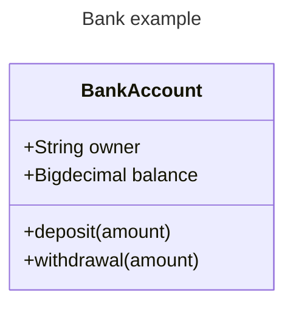

## 定义类


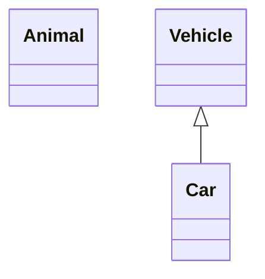

带标签的类

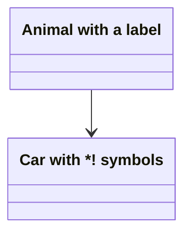

你也可以用反引号打标签

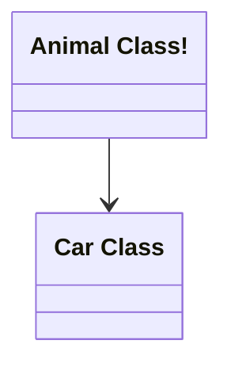

## 定义成员类型

mermaid有2中方法定义成员

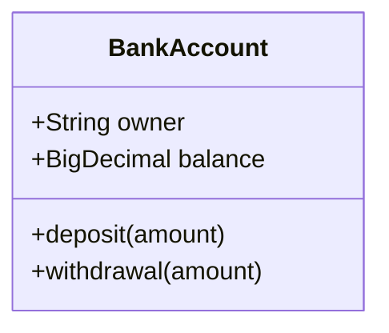


### 返回类型

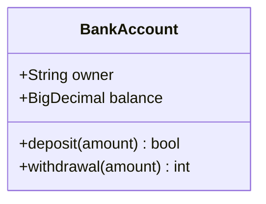

### 泛型

用波浪线代表泛型的尖括号

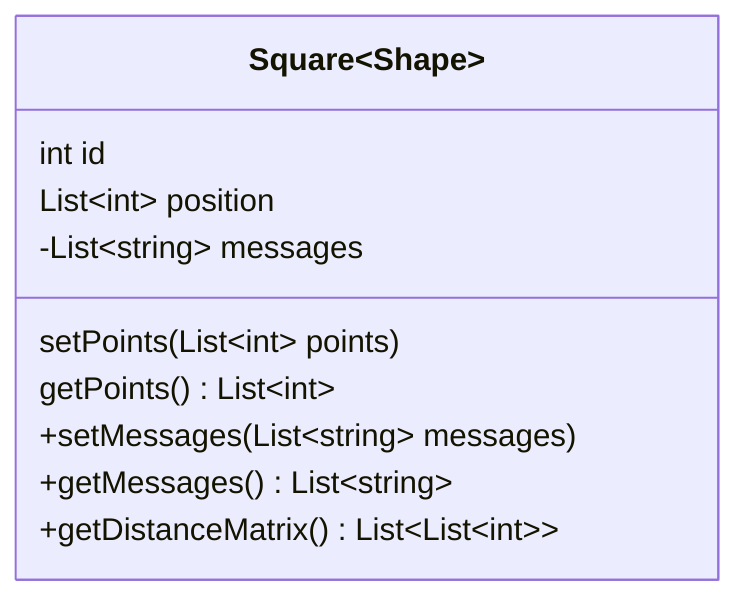

### 可见性

*   `+` 公共
*   `-` 私有
*   `#` 保护
*   `~` 包可见/内部

## 定义关系

|  Type  | Description |                 |
| :----: | :---------: | --------------- |
| `<|--` |    继承     | 空心三角形+实线 |
| `*--`  |    组合     | 实心菱形+实线   |
| `o--`  |    聚合     | 虚心菱形+实线   |
| `-->`  |    关联     | 实现箭头        |
|  `--`  | 连接 (实现) |                 |
| `..>`  |    依赖     | 虚线箭头        |
| `..|>` |    实现     | 空心三角形+虚线 |
|  `..`  | 连接 (虚线) |                 |

### 继承

**「继承」** 是面向对象语言的三大特性（封装，继承，多态）之一。子类继承父类。

UML类图中继承关系使用空心三角形+实线表示。

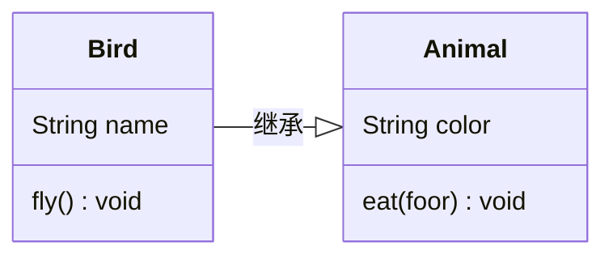


### 组合

**「组合」** 是关联关系的一种，表示一种强“拥有”关系。体现了严格的部分和整体的关系。部分和整体的生命周期一样。


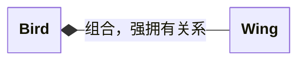


### 聚合

**「聚合」** 是关联关系的一种，表示一种弱的“拥有”关系。

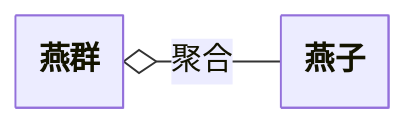


### 关联

依赖关系通常表现为类的<mark>私有属性</mark>。

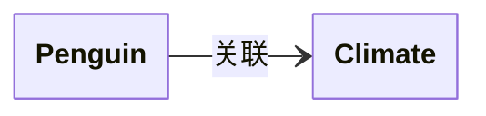


### 连接


```mermaid

```


### 依赖

**「依赖」** 关系体现为局部变量、方法的形参，或者对静态方法的调用。

```mermaid
---
config:
  class:
    hideEmptyMembersBox: true
---
classDiagram
direction LR
class Programmer {
	+work()  void
}

Programmer ..> Computer : 依赖
```


### 实现

**「实现」** 与继承类似，实现类继承接口中的方法。

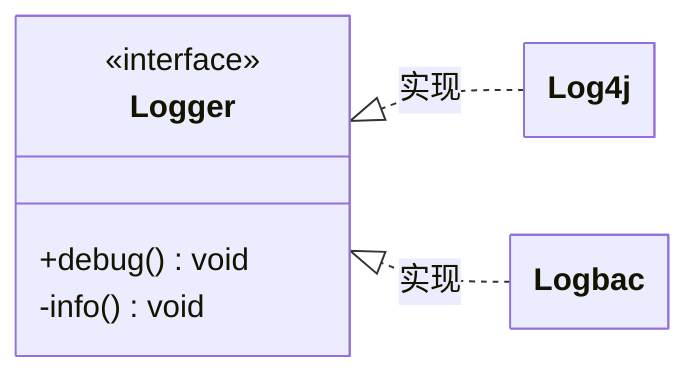

UML类图中实现关系使用空心三角形+虚线表示。
